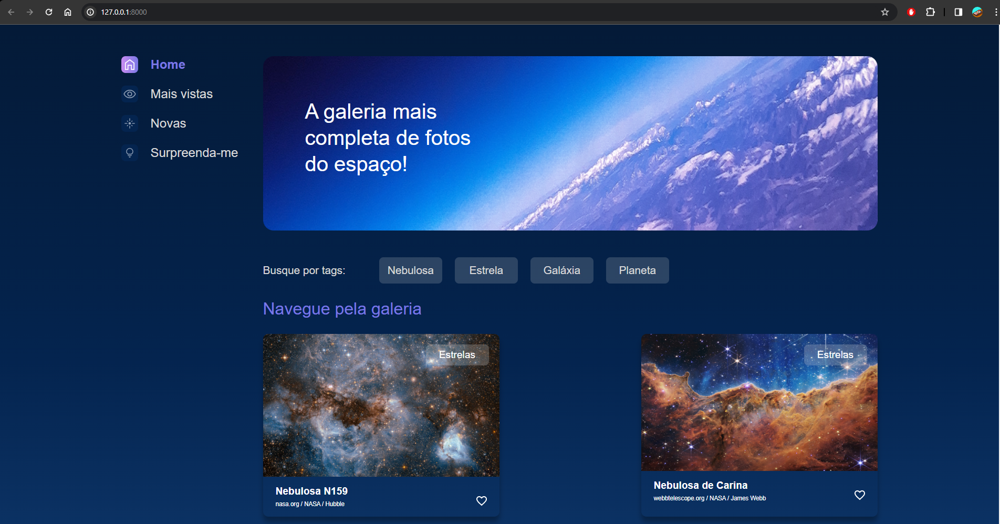
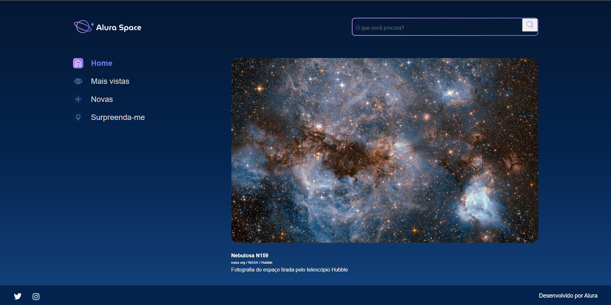
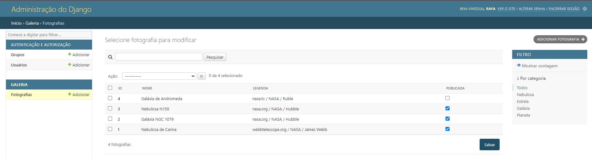

# Projeto Alura Space

O projeto consiste em uma aplicação web que disponibiliza um catálogo de imagens que foram tiradas do espaço a partir de telescópios, foram usados conceitos de criação e organização 
de projetos, utilização de banco de dados e administração da página de Admin do Django.

### Tecnologias utilizadas:
* Python
* Django
* SQLite3
* HTML, CSS (template desenvolvido pela própria Alura)

